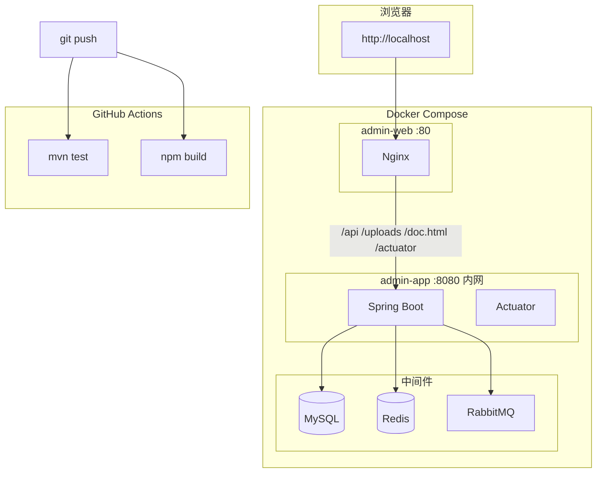

# Day49 阶段 D 总复习 + 全链路演示

> **恭喜完成 Day45–Day49。** 本文档串讲工程化能力，并给出 Docker 全栈演示脚本与更新版简历。

---

## 一、阶段 D 你完成了什么

| Day | 能力 |
|-----|------|
| 45 | GitHub Actions：Push 自动 `mvn test` + `npm run build` |
| 46 | 前端多阶段 Docker：Node 构建 dist → Nginx 托管 |
| 47 | 统一入口：仅 :80 对外，API/文档/Actuator 经 Nginx 反代 |
| 48 | Actuator：db / redis / rabbit 健康聚合 + K8s 探针 |
| 49 | 总复习（本文） |

加上阶段 C（Day39～44 MQ），项目已覆盖：**业务 → 消息队列 → CI/CD → 容器化部署 → 可观测性**。

---

## 二、两种运行方式（必记）

很多同学会混淆，这张表请背下来：

| | 本地开发 | Docker 全栈部署 |
|--|----------|----------------|
| **怎么启** | IDEA `mvn spring-boot:run` + `npm run dev` | `docker compose up -d --build` |
| **前端** | http://localhost:**5173**（Vite） | http://localhost:**80**（Nginx 容器） |
| **后端** | http://localhost:**8080** | 仅 Docker 内网，**不映射** 8080 |
| **代理** | `vite.config.js` proxy | `admin-web/nginx.conf` |
| **Actuator** | `:8080/actuator/health` | `:80/actuator/health` |
| **何时用** | 日常写代码、调试 | 演示、验收、模拟生产 |

> **nginx.conf 写在仓库里 ≠ IDEA 自动启动 Nginx。** Nginx 只在 `admin-web` Docker 容器里运行。

---

## 三、部署架构（Day47 + Day48）



**Nginx 转发路径：**

| 路径 | 目标 |
|------|------|
| `/` | Vue 静态 `dist/` |
| `/api/` | Spring Boot |
| `/uploads/` | Spring Boot |
| `/doc.html`、`/swagger-ui/` | Knife4j |
| `/actuator/` | Actuator 健康检查 |

---

## 四、阶段 C + D 能力串联

```text
写操作 → @OperationLog → MQ → operation_log 表 → 前端操作日志页
                              ↓ 失败
                         operlog DLQ → [MQ 告警]

商品变更 → MQ → 异步刷新 Redis product:info:{id}

git push → GitHub Actions → test + build 全绿

docker compose → Nginx:80 → app → MySQL/Redis/MQ
                              → /actuator/health 聚合状态
```

---

## 五、Docker 全栈演示脚本（5～8 分钟）

### 录屏前准备

```powershell
cd D:\project\study
docker compose up -d --build
docker compose ps
```

确认 **admin-web、admin-app、admin-mysql、admin-redis、admin-rabbitmq** 均为 Up。

### 演示流程

**1. 健康检查（30 秒）**

```powershell
Invoke-RestMethod http://localhost/actuator/health
Invoke-RestMethod http://localhost/api/health
```

口述：Actuator 自动检测 db/redis/rabbit；`/api/health` 是简单存活接口。

**2. 统一入口登录（40 秒）**

1. 浏览器打开 http://localhost
2. admin / 123456 登录
3. 展示侧边栏（含「操作日志」）

口述：前端由 Nginx 托管，API 同源反代，无需 CORS。

**3. 业务操作（60 秒）**

1. 修改一个商品名称
2. 进入「操作日志」→ 看到异步写入的记录
3. （可选）展示 http://localhost/doc.html 接口文档

**4. MQ 能力（30 秒，口述即可）**

- Day39～40：Demo / 重试 / DLQ
- Day41～43：操作日志异步 + 死信告警
- Day44：商品缓存 MQ 刷新

**5. CI（20 秒）**

打开 GitHub → Actions → 展示 CI workflow 全绿（若已推送）。

**6. 开发 vs 部署对比（20 秒）**

口述：开发用 5173+8080；部署用 Docker 80 统一入口。

---

## 六、最终验收清单

### 工程化

- [ ] `mvn test` 全绿
- [ ] `npm run build` 成功
- [ ] `.github/workflows/ci.yml` 存在
- [ ] `docker compose up -d --build` 全栈 Up
- [ ] http://localhost 可登录
- [ ] http://localhost/actuator/health → UP（含 db/redis/rabbit）
- [ ] `admin-app` 无宿主机 8080 映射（`docker compose ps`）

### 认知

- [ ] 能区分「本地开发」和「Docker 部署」的端口与代理
- [ ] 能解释 Nginx 在 Docker 里的角色
- [ ] 能说出 Actuator 和 `/api/health` 的区别
- [ ] 能画出 MQ 操作日志链路

---

## 七、简历项目描述（Day1–49 完整版）

**项目名称：** 企业级后台管理系统（前后端分离）

**技术栈：** Spring Boot 2.7、MyBatis-Plus、MySQL、Redis、RabbitMQ、JWT、Vue3、Element Plus、Docker、Nginx、GitHub Actions

**项目描述：**

- 后端 RESTful API：RBAC 接口级鉴权、商品/分类 CRUD、Redis 缓存与 Token 黑名单
- 认证与安全：Access/Refresh 双 Token、登出黑名单、Lua+ZSET 滑动窗口限流
- 消息队列：RabbitMQ 异步操作日志、死信队列告警、商品缓存异步刷新；手动 ACK 与重试
- 前端 Vue3：Layout、路由守卫、权限菜单、操作日志页、Axios 401 自动刷新
- 工程化：GitHub Actions CI；Docker Compose 全栈；Nginx 统一入口；Spring Boot Actuator 健康探针
- 测试：JUnit5 + Mockito 覆盖 JWT、Auth、限流等核心逻辑

**个人职责：**

- 独立完成前后端、MQ 业务落地、Docker 化部署与 CI 配置
- 设计拦截器链（限流 → JWT → 权限 → 操作日志 MQ）
- 配置多环境 Profile（dev / docker / prod）

---

## 八、面试高频题（阶段 C + D）

| 问题 | 要点 |
|------|------|
| RabbitMQ 核心概念？ | Exchange → Queue → Consumer；Producer 发消息解耦 |
| 手动 ACK 和自动 ACK？ | 手动需 basicAck/Nack；失败重试耗尽要 nack(requeue=false) 进 DLQ |
| 为什么操作日志用 MQ？ | 写接口不阻塞；消费端可扩容；最终一致 |
| CI 做了什么？ | Push 触发 test + build，合并前发现问题 |
| 多阶段 Dockerfile？ | Node 构建 + Nginx 运行，镜像更小 |
| 为什么 Nginx 统一 80？ | 隐藏后端端口、同源免 CORS、生产标准做法 |
| Actuator 和 /api/health？ | 前者聚合依赖状态+探针；后者简单存活 |
| liveness vs readiness？ | 存活=进程活着；就绪=能接流量（含 DB/Redis 等） |
| 本地开发和 Docker 区别？ | 5173+8080 vs 80；Vite proxy vs nginx.conf |

---

## 九、阶段 D 完结 → 阶段 E 可选方向

详见 [phase-e.md](./phase-e.md)，例如：

- Spring Security 替换手写 JWT
- HTTPS / 域名部署
- Kubernetes 入门
- 接口集成测试（Testcontainers）

---

## Day49 验收

- [ ] 通读本文，能区分两种运行方式
- [ ] Docker 全栈演示走通一遍
- [ ] 简历更新为第七节
- [ ] 能回答第八节至少 5 题

**阶段 D（Day45–49）正式完结。全项目 Day1–49 学习路线收官。**
