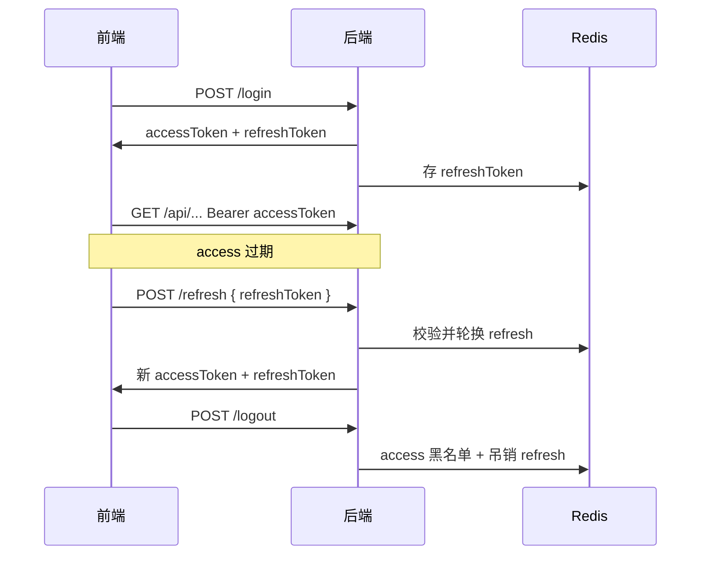

# Day36 双 Token（Access + Refresh）

> **Access Token** 短效，每次请求 API 携带；**Refresh Token** 长效，仅用于换新 Access Token。

## 流程



## 配置（application-dev.yml）

```yaml
jwt:
  expiration: 7200000          # Access：2 小时
  refresh-expiration: 604800000 # Refresh：7 天
```

## API 变更

### 登录 `POST /api/auth/login`

响应字段由 `token` 改为：

```json
{
  "accessToken": "...",
  "refreshToken": "...",
  "user": { ... }
}
```

### 刷新 `POST /api/auth/refresh`

```json
// 请求
{ "refreshToken": "..." }

// 响应
{
  "accessToken": "...",
  "refreshToken": "..."
}
```

### 登出 `POST /api/auth/logout`

Header：`Authorization: Bearer {accessToken}`  
Body（可选）：`{ "refreshToken": "..." }`

## 后端实现要点

| 组件 | 作用 |
|------|------|
| `JwtUtil` | `type=access/refresh` 区分双 Token |
| `JwtInterceptor` | 只接受 Access Token |
| `RefreshTokenService` | Redis 存 Refresh，支持吊销 |
| `TokenBlacklistService` | Access 登出黑名单（Day20 已有） |

## 前端实现要点

| 文件 | 变更 |
|------|------|
| `utils/auth.js` | 分别存 `accessToken` / `refreshToken` |
| `api/request.js` | 401 时自动调 `/refresh` 并重试请求 |
| `Login.vue` | 保存双 Token |

## 面试常问

- **为什么要双 Token？** Access 短效降低泄露风险；Refresh 长效避免频繁登录  
- **Refresh 放哪？** 可 HttpOnly Cookie（更安全）或 localStorage（本项目学习用）  
- **Refresh 轮换：** 每次刷新发新 Refresh，旧的 Redis 删除，防重放  
- **单 Token 黑名单 vs 双 Token：** Access 黑名单 + Refresh Redis 吊销，登出更彻底  

## Day36 验收

- [ ] 登录返回 `accessToken` + `refreshToken`
- [ ] `POST /api/auth/refresh` 能换新 Token
- [ ] 登出后旧 Token 不可用
- [ ] 前端 Access 过期后能自动刷新（或手动调 refresh 验证）
- [ ] `mvn test` 通过

## 下一步

- **Day37**：接口限流 → [rate-limit.md](./rate-limit.md)
- **Day38**：收尾复习
