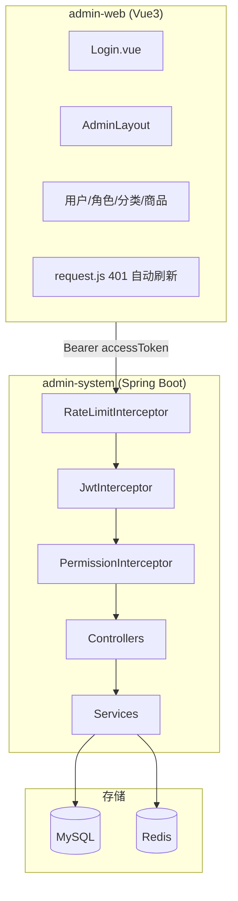

# Day38 阶段 B 收尾与总复习

> **恭喜完成 Day1–Day38。** 本文档用于：知识串讲、面试复习、演示验收、简历更新。

---

## 一、你完成了什么

```text
study/                          ← Git 根目录，IDEA 打开这里
├── admin-system/               ← Spring Boot 后端
├── admin-web/                  ← Vue3 前端
├── docker-compose.yml          ← MySQL + Redis + app
├── scripts/up.ps1              ← 一键 Docker 启动
└── docs/                       ← 各 Day 文档
```

| 阶段 | Day | 核心能力 |
|------|-----|----------|
| A 后端 | 1–20 | RBAC、商品、Redis 缓存、Token 黑名单 |
| B 前端 | 23–31 | Layout、路由守卫、CRUD 页面、联调 |
| B 部署 | 32–34 | Docker Compose、prod profile、jar 部署 |
| B+ 进阶 | 35–37 | 单元测试、双 Token、Lua+ZSET 限流 |
| B 收尾 | 38 | 总复习（本文） |

---

## 二、系统架构（一张图串起来）



**请求链路（带顺序）：**

```
浏览器 → RateLimit(429) → JWT(401) → Permission(403) → Controller → Service → DB/Redis
```

---

## 三、关键技术点速查

### 后端

| 主题 | 关键类/文件 | 一句话 |
|------|-------------|--------|
| RBAC | `PermissionInterceptor`、`rbac.sql` | 接口级权限 `@RequirePermission` |
| JWT | `JwtUtil`、`JwtInterceptor` | Access Token，`type=access` |
| 双 Token | `RefreshTokenService`、`/api/auth/refresh` | Refresh 存 Redis，支持轮换 |
| 登出 | `TokenBlacklistService` | Access 进黑名单 |
| 限流 | `RateLimitService` + Lua ZSET | 滑动窗口，Lua 原子 |
| 缓存 | `UserCacheService`、`ProductCacheService` | Redis 缓存热点数据 |
| 部署 | `application-{dev,docker,prod}.yml` | 三 Profile 分环境 |

### 前端

| 主题 | 文件 | 一句话 |
|------|------|--------|
| 登录态 | `utils/auth.js` | accessToken + refreshToken + user |
| 请求 | `api/request.js` | 401 自动 refresh 并重试 |
| 路由 | `router/index.js` | `requiresAuth` / `guest` 守卫 |
| 菜单 | `config/menu.js` + `hasPermission` | 按 permissions 显隐 |
| 布局 | `layout/AdminLayout.vue` | 侧边栏 + 顶栏 |

### 部署

| 方式 | 命令 | Profile |
|------|------|---------|
| Docker | `docker compose up -d --build` | docker |
| jar 本地 | `java -jar ... --spring.profiles.active=prod` | prod |
| 开发 | `mvn spring-boot:run` | dev |

---

## 四、文档索引（按 Day）

| Day | 文档 |
|-----|------|
| 31 | [phase-b-demo.md](./phase-b-demo.md) 演示 + 简历 |
| 32 | [docker.md](./docker.md) |
| 33 | [prod.md](./prod.md) |
| 34 | [deploy.md](./deploy.md) |
| 35 | [testing.md](./testing.md) |
| 36 | [dual-token.md](./dual-token.md) |
| 37 | [rate-limit.md](./rate-limit.md) |
| WSL | [install-wsl.md](./install-wsl.md) |

---

## 五、最终验收清单（打勾 = 阶段 B 全部完成）

### 启动

- [ ] `docker compose up -d --build` 三容器 running
- [ ] `GET /api/health` → `status: UP`
- [ ] `npm run dev` 前端可打开

### 业务

- [ ] admin 登录，5 个菜单可见
- [ ] liuyang 登录，菜单按权限收缩
- [ ] 用户/角色/分类/商品 CRUD 正常
- [ ] 商品封面上传可用

### 安全与进阶

- [ ] 登出后 Token 不可用（黑名单）
- [ ] 登录返回 `accessToken` + `refreshToken`
- [ ] 连续错误登录 11 次 → 429
- [ ] `mvn test` 全部通过

### 部署认知

- [ ] 能说出 dev / docker / prod 三种 Profile 区别
- [ ] 能解释 Docker Compose 三个服务各自干什么

---

## 六、5 分钟演示脚本（升级版，含 Day32–37）

1. **Docker 启动**（10 秒）：`docker compose ps` 展示三容器  
2. **登录**（20 秒）：admin 登录 → 展示 Layout + permissions  
3. **商品**（40 秒）：列表搜索 → 新增/编辑 → 上下架  
4. **权限**（20 秒）：liuyang 登录 → 菜单变少  
5. **登出**（10 秒）：logout → 再访问接口 401  
6. **（可选）限流**（10 秒）：快速错登 11 次 → 429  
7. **（可选）测试**（10 秒）：IDEA 跑 `mvn test` 全绿  

录屏参考：[phase-b-demo.md](./phase-b-demo.md)

---

## 七、简历项目描述（完整版，Day1–38）

**项目名称：** 企业级后台管理系统（前后端分离）

**技术栈：** Spring Boot 2.7、MyBatis-Plus、MySQL、Redis、JWT、Vue3、Element Plus、Vite、Docker

**项目描述：**

- 后端 RESTful API：RBAC 接口级鉴权、商品分类树与商品 CRUD、Redis 缓存与 Token 黑名单
- 认证体系：Access/Refresh 双 Token、Refresh 轮换与 Redis 吊销、登出黑名单
- 安全：基于 Redis ZSET + Lua 的滑动窗口限流，登录接口防暴力破解
- 前端 Vue3 管理端：Layout、路由守卫、按 permissions 动态菜单、Axios 401 自动刷新 Token
- 部署：Docker Compose 一键启动 MySQL/Redis/应用；Maven 打包 + 多 Profile（dev/docker/prod）
- 测试：JUnit5 + Mockito 覆盖 JWT、Auth、限流等核心逻辑

**个人职责：**

- 独立完成前后端核心模块、联调与 Docker 化部署
- 设计 RBAC 数据模型与拦截器链（限流 → JWT → 权限）
- 封装统一响应、全局异常、文件上传与分页查询

---

## 八、面试高频题（自测）

| 问题 | 要点 |
|------|------|
| JWT 怎么实现的？ | 登录签发 HS256；Interceptor 验签 + 黑名单；Payload 存 userId |
| 为什么双 Token？ | Access 短效降泄露风险；Refresh 长效免频繁登录 |
| 登出怎么失效？ | Access 进 Redis 黑名单；Refresh 从 Redis 删除 |
| 限流怎么做的？ | ZSET 记时间戳 + Lua 原子删/数/写；按 IP 分 login/api 两档 |
| 固定窗口 vs 滑动窗口？ | 固定窗口边界可 2 倍突发；滑动窗口按过去 N 秒精确计数 |
| 前后端权限怎么配合？ | 后端 `@RequirePermission` 403；前端 menu + 路由守卫 UX |
| Docker 干什么？ | 环境一致、一键启停 MySQL+Redis+后端 |
| 单元测试怎么测 Service？ | Mockito mock Mapper，`@ExtendWith(MockitoExtension.class)` |

---

## 九、下一步建议（Day38 之后）

| 方向 | 建议 |
|------|------|
| 求职 | 按本文第七节更新简历；录 5 分钟演示视频 |
| 深化 | Spring Security 替换手写 JWT；Gateway 统一鉴权 |
| 运维 | Nginx 反代 + HTTPS；CI/CD（GitHub Actions 跑 test + build） |
| 前端 | 前端也 Docker 化（nginx 托管 dist） |
| 数据 | 加操作日志、审计表 |

---

## Day38 验收

- [ ] 通读本文，架构图能自己画出来
- [ ] 最终验收清单全部打勾
- [ ] 简历已更新为第七节完整版
- [ ] 能口头回答第八节至少 5 道题

**阶段 B（Day23–Day38）正式完结。**
